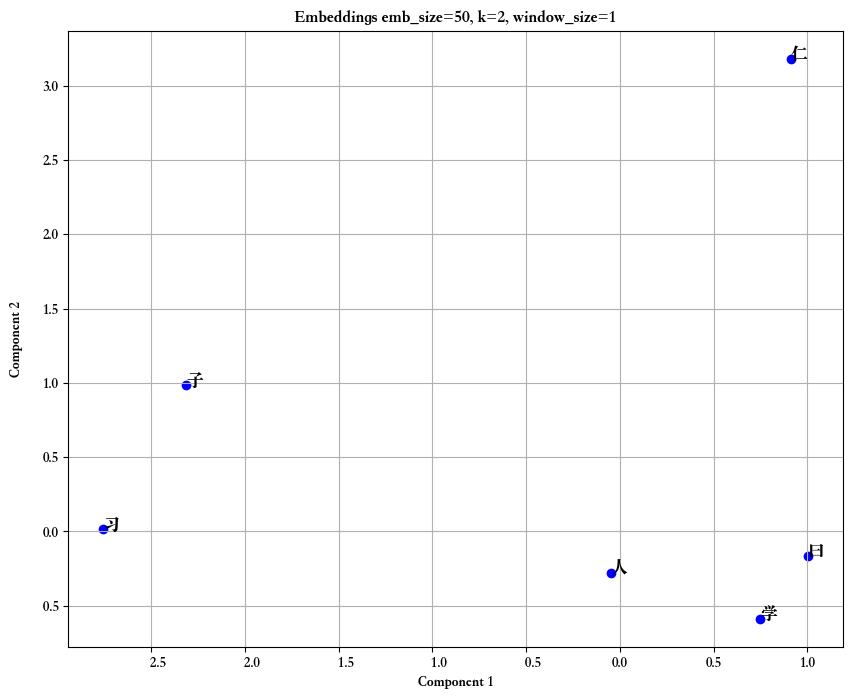
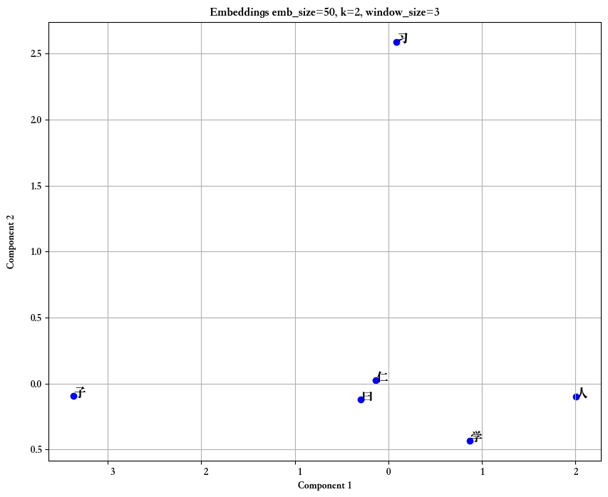
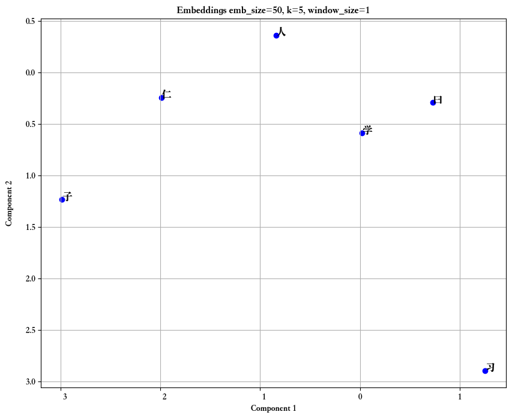
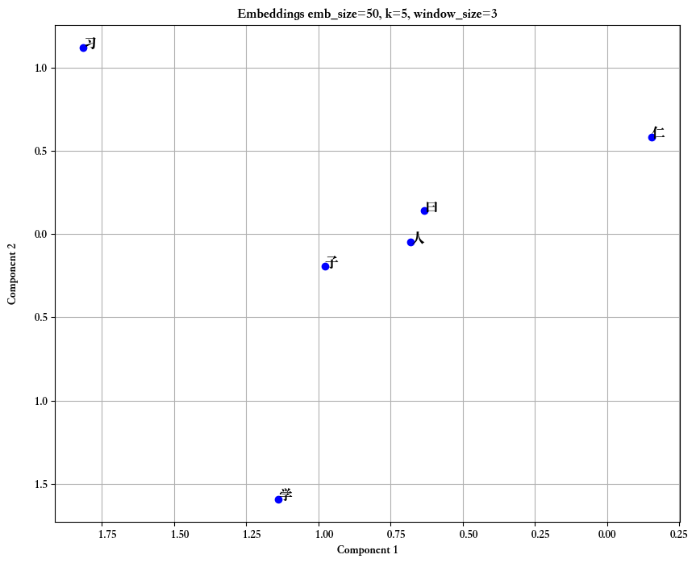
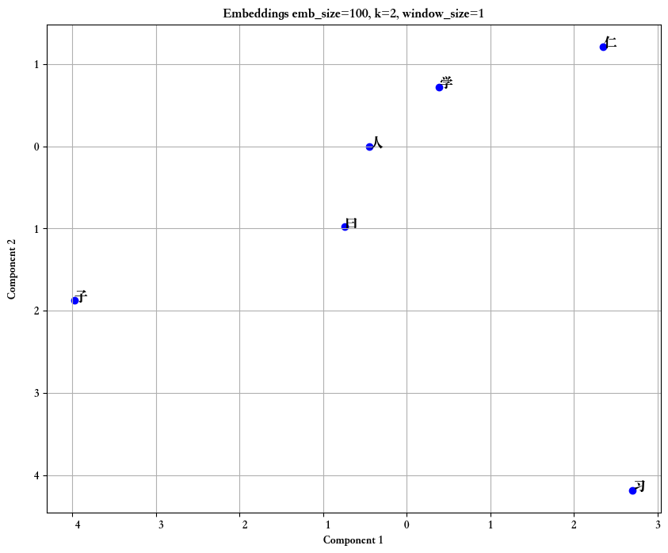
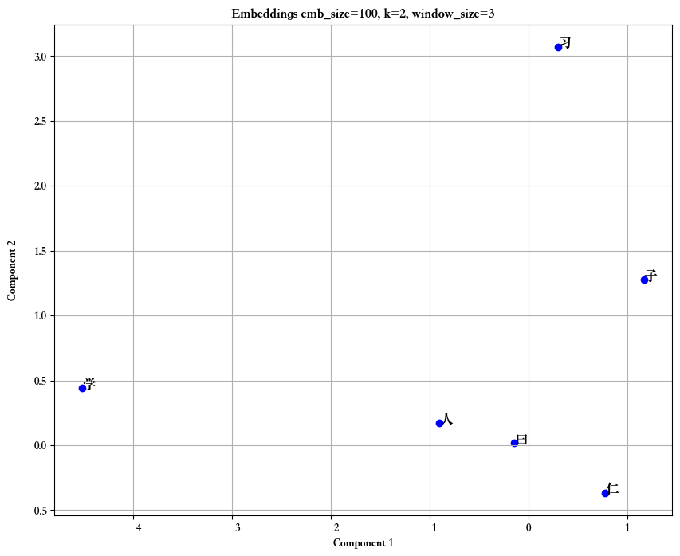
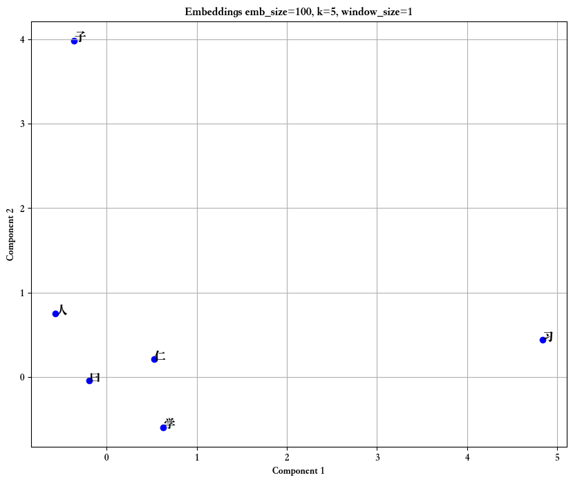
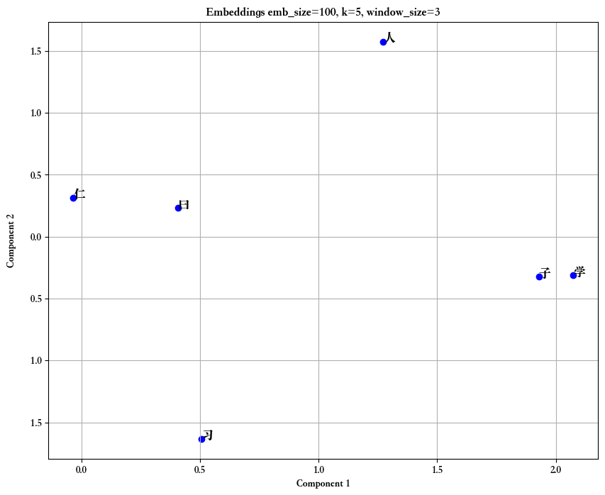
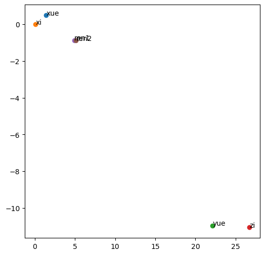

# CS310 Natural Language Processing - Assignment 2 Word2vec Implementation 

12310520 芮煜涵

## Requirement3

### Printing Interval

In the train function, I set it to print the average loss after every epoch with 

```python
print(f"Epoch {epoch} - Average Loss: {total_loss/(num_batches):.4f}")
```

I chose to print per epoch instead of every 20 batches, 

```python
if num_batches % 20 == 0:
                lr = scheduler.get_last_lr()[0] 
                print(f"Epoch {epoch} Batch {num_batches} - Loss: {loss.item():.4f}, Learning Rate: {lr:.6f}")
```

This print interval was determined based on the dataset size (lunyu_20chapters.txt) and batch size (batch_size = 16). Every 20 batches corresponds to approximately 320 samples (20 × 16), providing a good balance between observing the loss trend early in training and avoiding excessive output.

### Screenshots of loss change:


### Determining the Required Training Epochs

I determine the number of epochs by monitoring the average loss per epoch (total_loss / num_batches). When the loss stops decreasing significantly (e.g., by less than 0.05) over several epochs, it suggests the model has converged.

In my code, I **set epochs = 15** and used the CosineAnnealingLR scheduler to adjust the learning rate dynamically. By observing the output, I can identify when the loss stabilizes.

If the loss decrease over 2-3 consecutive epochs is **less than 0.05**, I consider training complete. In this case, the loss stabilizes by epoch 14(the loss of epoch 13 is 0.8137, the loss of epoch 14 is 0.7504, the loss decrease is quite near 0.05), making 15 epochs a reasonable choice.

## Requirement4

| `emb_size` | `k`  | `window_size` | `time` |
| ---------- | ---- | ------------- | ------ |
| 50         | 2    | 1             | 2.48s  |
| 50         | 2    | 3             | 7.22s  |
| 50         | 5    | 1             | 2.52s  |
| 50         | 5    | 3             | 7.56s  |
| 100        | 2    | 1             | 2.49s  |
| 100        | 2    | 3             | 7.49s  |
| 100        | 5    | 1             | 2.41s  |
| 100        | 5    | 3             | 7.23s  |

The dominant factor of running time is `window_size`.

## Requirement5

### 8 embeddings

<table>
  <tr>
    <td></td>
    <td></td>
  </tr>
  <tr>
    <td></td>
    <td></td>
  </tr>
  <tr>
    <td></td>
    <td></td>
  </tr>
  <tr>
    <td></td>
    <td></td>
  </tr>
</table>

### Difference from that in Lab4

<table>
  <tr>
    <td></td>
    <td></td>
  </tr>

In the A2 task, the trained word embeddings exhibit a scattered distribution. After applying Truncated SVD, the two components of '子' (zǐ) and '学' (xǔe) are relatively close in distance, but in the context of the Chinese language, their meanings differ significantly. 

In contrast, in the embeddings from Lab 4, '学' (xǔe) and '习' (xí), as well as '人' (rén) and '仁' (rén), are positioned close to each other, which aligns well with their semantic similarity in the Chinese context, indicating that this embedding performs effectively.